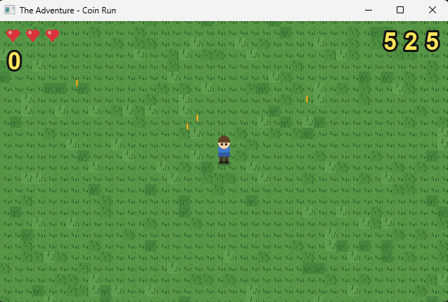

# The Adventure — Coin Run

A small top-down survival game built on the `ProjectSkeleton` SDL starter for the .NET
final assignment. You wander a tile-based grass map collecting spinning coins for score
while green slimes chase you from the edges. Click anywhere (or press **Space**) to drop a
bomb whose explosion vaporises nearby slimes. Three hearts of health; lose them all and
it's **Game Over**, reach **500 points** and you win. The high score persists between runs
in `highscore.json`.

## Build and run

Requires **.NET 10 SDK** (the project targets `net10.0`).

```powershell
cd ProjectSkeleton-main
dotnet run
```

On a clean clone this restores NuGet packages (Silk.NET.SDL 2.23, SixLabors.ImageSharp
3.1) and copies everything under `Assets/` next to the binary, then opens a 640 × 400
window.

If you don't have the .NET 10 SDK yet:

```powershell
winget install Microsoft.DotNet.SDK.10
```

## Controls

| Action            | Keys                          |
|-------------------|-------------------------------|
| Move              | Arrow keys / **WASD**         |
| Drop bomb at cursor | Left mouse click            |
| Drop bomb at feet | **Space**                     |
| Restart after win/loss | **R**                    |
| Quit              | **Esc** (or close the window) |

## Win and lose

- **Lose** when health reaches 0 (slime contact costs 1 health; ~1 s i-frames after a hit).
- **Win** when score reaches 500 (coins are 25 pts, slime kills 50 pts).
- High score is loaded on startup and written back on clean exit.

## Gameplay screenshot



## Project structure

```
ProjectSkeleton-main/
├─ Program.cs               main loop
├─ Engine.cs                frame orchestration, spawn/collisions/HUD
├─ Input.cs                 keyboard + click + Space + R
├─ GameRenderer.cs          [AI] SDL renderer + ImageSharp texture loader
├─ GameWindow.cs            [AI] SDL window, IDisposable
├─ Camera.cs                [AI] world↔screen camera with bounds
├─ GameWorld.cs             score / health / status state machine
├─ SaveManager.cs           async high-score persistence
├─ IGameEntity.cs           IGameEntity / IUpdatable / ICollidable
├─ Exceptions/
│   └─ AssetLoadException.cs   custom exception
├─ Models/
│   ├─ GameObject.cs            [AI]
│   ├─ RenderableGameObject.cs  [AI]
│   ├─ TemporaryGameObject.cs   [AI]
│   ├─ SpriteSheet.cs           [AI] JSON-driven sheet + animation
│   ├─ TextureData.cs           [AI]
│   ├─ PlayerObject.cs          movement, i-frames, anim switching
│   ├─ Coin.cs, Enemy.cs        gameplay entities
│   └─ Data/{Level,Layer,Tile,TileSet}.cs  [AI] Tiled JSON
├─ Assets/                  generated PNGs + JSON sprite-sheet + Tiled map
├─ tools/generate_assets.py asset generator (Python + Pillow)
├─ AI_USAGE.md              authorship disclosure (required)
└─ README.md
```

## Demonstrated language / framework features

The assignment asks for at least three of: LINQ, generics, interfaces, inheritance,
async/await, pattern matching, IDisposable, custom exceptions. All eight are present:

- **Inheritance** — `GameObject → RenderableGameObject → {PlayerObject, Coin, Enemy,
  TemporaryGameObject}`.
- **Interfaces** — `IGameEntity`, `IUpdatable`, `ICollidable` (Player / Coin / Enemy).
- **Generics** — Silk.NET's `Rectangle<int>`, `Dictionary<int, …>`, `.OfType<T>()`.
- **LINQ** — `OfType<Coin>().Where(…).ToList()`, `Any`, `Count` in `Engine.HandleCollisions`
  and `Engine.DropBomb`.
- **Pattern matching** — `is TemporaryGameObject { IsExpired: true }` for expiry pruning;
  `switch` over `GameStatus` for HUD banners.
- **async / await** — `SaveManager` (`File.ReadAllTextAsync` / `WriteAllTextAsync`),
  awaited from `Program.Main` and `Engine.SetupWorldAsync`.
- **IDisposable** — `GameWindow` (explicit `Dispose` + finalizer, used via `using`).
- **Custom exceptions** — `AssetLoadException` thrown from texture / JSON loaders.

## Asset pipeline

All art and map data is **generated** by `tools/generate_assets.py` (Pillow):

```powershell
pip install pillow
python tools\generate_assets.py
```

The script is deterministic (seeded RNG), so re-running reproduces the same PNGs and
JSON. Re-runs are not required for normal builds — the generated files are committed
under `Assets/`.

## AI usage summary

About **35 %** of the C# I wrote was AI-generated verbatim (the SDL interop / JSON model
plumbing), wrapped in `// AI-generated` markers and listed in `AI_USAGE.md`. The remaining
**65 %** — game logic, gameplay entities, the engine orchestration layer, input handling,
the save manager — was written by hand. See `AI_USAGE.md` for the full disclosure,
file-by-file split, and reproducible audit command.